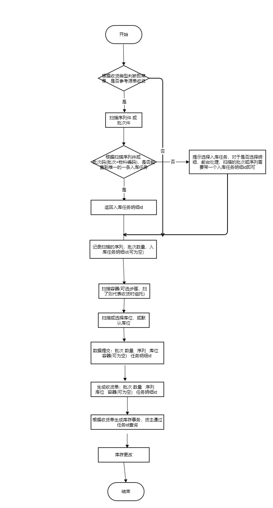

# WMS业务功能&单据
## 问题点
1. 空的容器是否需要进行库位管理? 
    - 管理，空容器进行移动时，需要进行转移操作，操作不便。
    - **不管理，拆托时进行判断是否为空，为空则去掉与库位之间得联系。** 
2. 在做转移时的是否考虑货主，需要贴货主条码？不然无法确定同批次不同货主的库存
3. 需要一个操作代码来表示对源容器的操作类型，后台无法根据数据来判断用户的操作类型,前台传入或后台只判断简单的，判断不了抛出异常：源容器的所有内容 源容器的部分物料批次 

## 收货

- 业务需求
    - 货拉到仓库门口，仓库进行收货，见流程图
          
       1. 无来源收货，直接扫序列或者批次，
       2. 有来源收货

- 业务单据
    - 将批次或序列收货到了哪个库位，或哪个库位的容器中，可能对应一条入库任务，也可能不对应。
        - 物料 批次 数量   序列   库位   容器(可为空)   任务明细id  
- 数据说明   
      - **容器需要判断库位，若含有库位并等于“库位”，则表示将物料放入库位上的容器中，若库位不一致，报错；若无库位，表示为一个全新的容器，需要建立容器与库位质检的联系**
   | 物料 | 批次 | 数量 |  序列 |  库位 |  容器(可为空) |  任务明细id | 操作说明 |
   | :---: | :---: | :---:| :---:| :---:| :---:| :---:| :---:|
   |mrl001 |20200507|4|  |  001-001-001 |  |  |无来源入库， 4个批次为20200507的mrl001 入库到001-001-001 库位| 
   |mrl001 |20200507001|1| sn001  |  001-001-001 |  |  |无来源入库， 序列为sn001批次为20200507001的mrl001 入库到001-001-001 库位| 
   |mrl001 |20200507|4|  |  001-001-001 |  | qwertew |有来源来源入库， 4个批次为20200507的mrl001 入库到001-001-001 库位,对应的入库任务id为qwertew| 
   |mrl001 |20200507001|1| sn001  |  001-001-001 |  | qwertew |有来源入库， 序列为sn001批次为20200507001的mrl001 入库到001-001-001 库位 对应的入库任务id为qwertew| 
   |mrl001 |20200507|4|  |  001-001-001 | ct001 |  |无来源入库， 4个批次为20200507的mrl001 入库到001-001-001 库位,并放置到ct001容器中| 
   |mrl001 |20200507001|1| sn001  |  001-001-001 | ct001  |  |无来源入库， 序列为sn001批次为20200507001的mrl001 入库到001-001-001 库位，并放置到ct001容器中| 
   |mrl001 |20200507|4|  |  001-001-001 | ct001 | qwertew |有来源来源入库， 4个批次为20200507的mrl001 入库到001-001-001 库位,对应的入库任务id为qwertew，并放置到ct001容器中| 
   |mrl001 |20200507001|1| sn001  |  001-001-001 | ct001  | qwertew |有来源入库， 序列为sn001批次为20200507001的mrl001 入库到001-001-001 库位 对应的入库任务id为qwertew，并放置到ct001容器中| 

## 质检
- 业务需求
    - 质检是否要走出库？？？
- 业务单据
    - 质检模块通知仓库 哪个库位的哪个容器中的批次 或序列的合格数量或不合格数量
        - 库位 容器(可为空) 批次 序列 不合格数量 
## 组托
- 业务需求 

    1. 组托 库位中容器外的物料组托
    2. 拆托 容器中的物料拆托
    3. 拆托并组托  同库位或目标容器为空 才可支持 否则为转移 
          特殊说明：1.将源容器中的所有内容组到新容器时，依然需要查询出子容器或序列或批次，做提交   
                   2.将源容器作为子容器进行组托时，提交的数据中源容器和子容器相等
          
- 业务单据   
      **目标容器可能在库位，也可能为一个空的容器**

    - 数据结构 源容器拆托 目标容器组托
        库位  源容器  子容器 物料 批次 数量 目标容器
    - 数据说明   
        
        | 库位 | 源容器 | 子容器 | 物料 | 批次 | 数量 | 序列 | 目标容器 | 操作说明 |
        | :---: | :---: | :---: | :---: | :---: | :---: | :---: | :---: | :---: |
        | 001-001-001 |  |  |  mrl001 | 20200507 | 2 |  | ct003 | 组：将库位001-001-001 上的mrl001物料批次20200507 数量2 放入容器ct003中 |  
        | 001-001-001 |  |  |  mrl001 | 20200507001 | 1 | sn123 | ct003 | 组：将库位001-001-001 上序列码为sn123的mrl001物料批次20200507001 放入容器ct003中 | 
        | 001-001-001 | ct001 | ct001 |   |  |  |  | ct003 | 组：将容器ct001作为子容器放入容器ct003中 | 
        | 001-001-001 | ct003 |  |  mrl001 | 20200507 | 2 |  |  | 拆：从库位001-001-001 上容器ct003中拆出mrl001物料批次20200507 数量2  |  
        | 001-001-001 | ct003 |  |  mrl001 | 20200507001 | 1 | sn123 |  | 拆：从库位001-001-001 上容器ct003中拆出序列sn123的mrl001物料批次20200507001  | 
        | 001-001-001 | ct003 | ct001  |   |  |  |  |  | 拆：从库位001-001-001 上容器ct003中拆出子容器ct001  |
        | 001-001-001 | ct004 |  |  mrl001 | 20200507 | 2 |  | ct003 | 拆组：从库位001-001-001 上ct004容器拆出mrl001物料批次20200507 数量2 并放入容器ct003中 |  
        | 001-001-001 | ct004 |  |  mrl001 | 20200507001 | 1 | sn123 | ct003 | 拆组：从库位001-001-001 上ct004容器拆出序列码为sn123的mrl001物料批次20200507001 并放入容器ct003中 | 
        | 001-001-001 | ct004 | ct001 |   |  |  |  | ct003 | 拆组：从库位001-001-001 上ct004容器拆出放入容器ct003中 | 
## 上架
- 业务需求
    - 将待上架区(暂为收货缓冲区)中的物料批次序列 或容器 上架到库位
- 业务单据
    - 数据结构
        - 库位 容器 物料 批次 序列 数量 目标库位 
    - 数据说明  

        | 库位 | 容器 | 物料 | 批次 | 序列 | 数量 | 目标库位 | 操作说明 |
        | :---: | :---: | :---: | :---: | :---: | :---: | :---: | :---: |
        | 001-001-001 | ct004 |   |   |   |   |   001-002-002 | 将001-001-001 库位上的ct004容器 放置到 001-002-002 库位上 |
        | 001-001-001 |  | mrl001 | 20200507 |  | 4  | 001-002-002 | 将001-001-001 库位上的4个批次为20200507的mrl001物料 放到库位 001-002-002上 |
        | 001-001-001 |  | mrl001 | 20200507001 | sn001 | 1  | 001-002-002 | 将001-001-001 库位上的序列码为sn001批次为20200507的mrl001物料 放到库位 001-002-002上 |
        

## 转移
- 业务需求   
    库位之间的操作，目标容器可为空，目标容器若有库位 需要校验是否为目标库位。   
    **需要支持库位上的容器可能
    1. 库位上的整个容器转移至另一个库位
	2. 库位上的整个容器作为子容器转移至另一个库位上容器中(也可到理货区拆托组托完成) 组
	3. 库位上容器中的 批次件 或 序列件 或 子容器转移至另一个库位 
	4. 库位上容器中的 批次件 或 序列件 或 子容器转移至另一个库位上的容器中 拆 组
    5. 库位上的批次或序列转移至另一个库位
- 业务单据
    - 数据结构
        - 源库位 容器 子容器 物料 批次 序列 数量  目标容器 目标库位
    - 数据说明   

        | 源库位 | 容器 | 子容器 | 物料 | 批次 | 序列 | 数量  | 目标容器 | 目标库位 | 操作说明 |
        | :---: | :---: | :---: | :---: | :---: | :---: | :---: | :---: | :---: | :---: |
        | 001-002-002 |   |   |  mrl001  |  20200507  |   |  20  |    |  001-002-003  | 将库位001-002-002 上的20个批次为20200507的mrl001物料转移至 库位001-002-003 |
        | 001-002-002 |   |   |  mrl001  |  20200507  | sn002  |  1  |    |  001-002-003  | 将库位001-002-002 上的序列码为sn002批次为20200507的mrl001物料转移至 库位001-002-003 |
        | 001-002-002 | ct002 |   |   |   |   |    |    |  001-002-003  | 将库位001-002-002 上的ct002容器转移至 库位001-002-003 |
        | 001-002-002 | ct002 |   |  mrl001  |  20200507  |   |  20  |    |  001-002-003  | 将库位001-002-002 上容器ct002中的20个批次为20200507的mrl001物料转移至 库位001-002-003 |
        | 001-002-002 | ct002 |   |  mrl001  |  20200507  | sn002  |  1  |    |  001-002-003  | 将库位001-002-002 上容器ct002中的序列码为sn002批次为20200507的mrl001物料转移至 库位001-002-003 |
        | 001-002-002 | ct002 | ct001 |   |   |   |    |    |  001-002-003  | 将库位001-002-002 上的ct002容器中的子容器ct001转移至 库位001-002-003 |

        | 001-002-002 |   |   |  mrl001  |  20200507  |   |  20  |  ct004  |  001-002-003  | 将库位001-002-002 上的20个批次为20200507的mrl001物料转移至 库位001-002-003 上的 ct004容器中 |
        | 001-002-002 |   |   |  mrl001  |  20200507  | sn002  |  1  |  ct004  |  001-002-003  | 将库位001-002-002 上的序列码为sn002批次为20200507的mrl001物料转移至 库位001-002-003 上的 ct004容器中 |
        | 001-002-002 | ct002 |   |   |   |   |    |   ct004 |  001-002-003  | 将库位001-002-002 上的ct002容器作为子容器转移至 库位001-002-003 上的 ct004容器中 |
        | 001-002-002 | ct002 |   |  mrl001  |  20200507  |   |  20  |  ct004  |  001-002-003  | 将库位001-002-002 上容器ct002中的20个批次为20200507的mrl001物料转移至 库位001-002-003 上的 ct004容器中 |
        | 001-002-002 | ct002 |   |  mrl001  |  20200507  | sn002  |  1  |  ct004  |  001-002-003  | 将库位001-002-002 上容器ct002中的序列码为sn002批次为20200507的mrl001物料转移至 库位001-002-003 上的 ct004容器中 |
        | 001-002-002 | ct002 | ct001 |   |   |   |    |  ct004  |  001-002-003  | 将库位001-002-002 上的ct002容器中的子容器ct001转移至 库位001-002-003 上的 ct004容器中 |
          
         

## 拣货(只能直接拿库位上的一层物料)
- 业务需求
    - 从库位上拿整个容器
    - 从库位上拿容器外的 批次 序列 数量
- 业务单据
    - 数据结构
        - 库位 容器 物料 批次 序列 数量 目标库位 目标容器
    - 数据说明
## 理货(有任务的转移)
- 业务需求
    - 理货区内 ，按照理货任务进行拆托，组托
- 业务单据
    - 数据结构
        - 库位 来源容器 物料 批次 序列 数量 目标容器
## 出库
- 业务需求
    - 
- 业务单据
    - 数据结构
        - 库位 容器 物料 批次 序列 数量 
    - 数据说明
    
