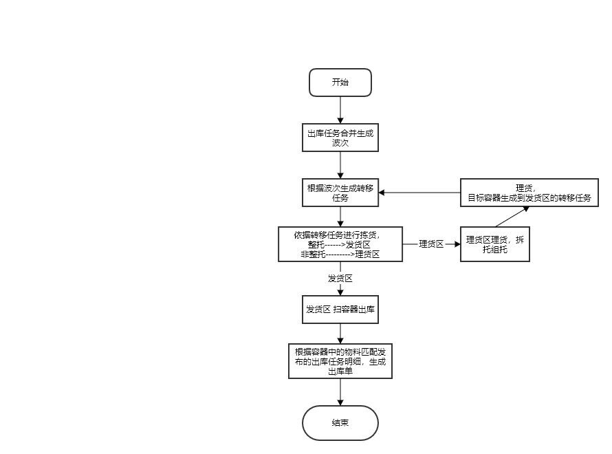
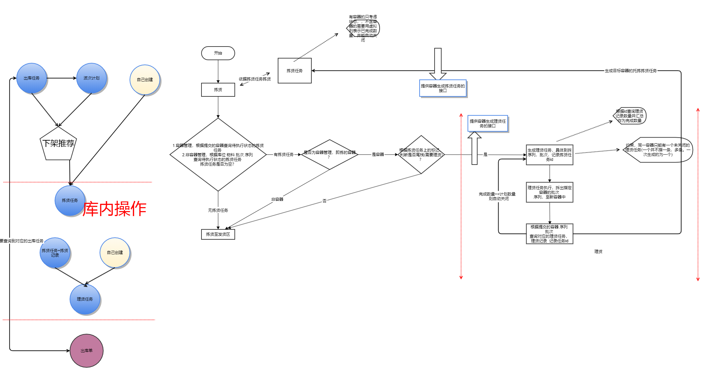
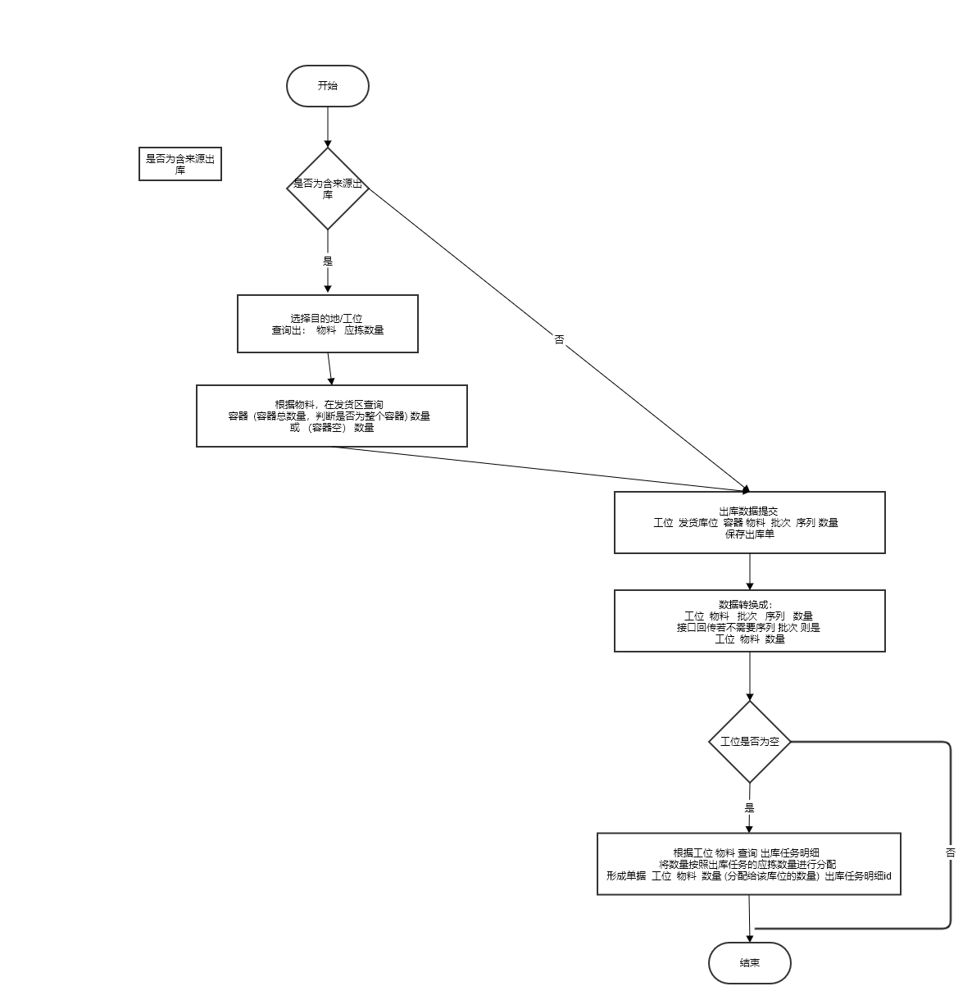

# WMS业务功能&单据
## 问题点
1. 空的容器是否需要进行库位管理? 
    - 管理，空容器进行移动时，需要进行转移操作，操作不便。
    - **不管理，拆托时进行判断是否为空，为空则去掉与库位之间得联系。** 
2. 在做转移时的是否考虑货主，需要贴货主条码？不然无法确定同批次不同货主的库存
3. 需要一个操作代码来表示对源容器的操作类型，后台无法根据数据来判断用户的操作类型,前台传入或后台只判断简单的，判断不了抛出异常：源容器的所有内容 源容器的部分物料批次 
4. 单据字段相似 可取并集 将源库位 容器 子容器 物料 批次 序列 数量  目标容器 目标库位作为父类 
5. 拣货优化点，，增加最外层容器  和 当前 容器 ，最外层用于托拣 ，当前容器容器用于理货，可实现推荐到子容器中的物料
6. 容器，物料，批次，序列，数量 ，有时对整个容器的操作(如出库)，只记容器，有时需要传所有的内容(如转移整个容器内容)，即物料 批次、、、需要做统一约定。
## 收货

- 业务需求
    - 货拉到仓库门口，仓库进行收货，见流程图
          
       1. 无来源收货，直接扫序列或者批次，
       2. 有来源收货

- 业务单据
    - 将批次或序列收货到了哪个库位，或哪个库位的容器中，可能对应一条入库任务，也可能不对应。
        - 物料 批次 数量   序列   库位   容器(可为空)   任务明细id  
- 数据说明   
      - **容器需要判断库位，若含有库位并等于“库位”，则表示将物料放入库位上的容器中，若库位不一致，报错；若无库位，表示为一个全新的容器，需要建立容器与库位质检的联系**
   | 物料 | 批次 | 数量 |  序列 |  库位 |  容器(可为空) |  任务明细id | 操作说明 |
   | :---: | :---: | :---:| :---:| :---:| :---:| :---:| :---:|
   |mrl001 |20200507|4|  |  001-001-001 |  |  |无来源入库， 4个批次为20200507的mrl001 入库到001-001-001 库位| 
   |mrl001 |20200507001|1| sn001  |  001-001-001 |  |  |无来源入库， 序列为sn001批次为20200507001的mrl001 入库到001-001-001 库位| 
   |mrl001 |20200507|4|  |  001-001-001 |  | qwertew |有来源来源入库， 4个批次为20200507的mrl001 入库到001-001-001 库位,对应的入库任务id为qwertew| 
   |mrl001 |20200507001|1| sn001  |  001-001-001 |  | qwertew |有来源入库， 序列为sn001批次为20200507001的mrl001 入库到001-001-001 库位 对应的入库任务id为qwertew| 
   |mrl001 |20200507|4|  |  001-001-001 | ct001 |  |无来源入库， 4个批次为20200507的mrl001 入库到001-001-001 库位,并放置到ct001容器中| 
   |mrl001 |20200507001|1| sn001  |  001-001-001 | ct001  |  |无来源入库， 序列为sn001批次为20200507001的mrl001 入库到001-001-001 库位，并放置到ct001容器中| 
   |mrl001 |20200507|4|  |  001-001-001 | ct001 | qwertew |有来源来源入库， 4个批次为20200507的mrl001 入库到001-001-001 库位,对应的入库任务id为qwertew，并放置到ct001容器中| 
   |mrl001 |20200507001|1| sn001  |  001-001-001 | ct001  | qwertew |有来源入库， 序列为sn001批次为20200507001的mrl001 入库到001-001-001 库位 对应的入库任务id为qwertew，并放置到ct001容器中| 

## 质检
- 业务需求
    - 质检是否要走出库？？？
- 业务单据
    - 质检模块通知仓库 哪个库位的哪个容器中的批次 或序列的合格数量或不合格数量
        - 库位 容器(可为空) 批次 序列 不合格数量 
## 组托
- 业务需求 

    1. 组托 库位中容器外的物料组托
    2. 拆托 容器中的物料拆托
    3. 拆托并组托  同库位或目标容器为空 才可支持 否则为转移 
          特殊说明：1.将源容器中的所有内容组到新容器时，依然需要查询出子容器或序列或批次，做提交   
                   2.将源容器作为子容器进行组托时，提交的数据中源容器和子容器相等
          
- 业务单据   
      **目标容器可能在库位，也可能为一个空的容器**

    - 数据结构 源容器拆托 目标容器组托
        库位  源容器  子容器 物料 批次 数量 目标容器
    - 数据说明   
        
        | 库位 | 源容器 | 子容器 | 物料 | 批次 | 数量 | 序列 | 目标容器 | 操作说明 |
        | :---: | :---: | :---: | :---: | :---: | :---: | :---: | :---: | :---: |
        | 001-001-001 |  |  |  mrl001 | 20200507 | 2 |  | ct003 | 组：将库位001-001-001 上的mrl001物料批次20200507 数量2 放入容器ct003中 |  
        | 001-001-001 |  |  |  mrl001 | 20200507001 | 1 | sn123 | ct003 | 组：将库位001-001-001 上序列码为sn123的mrl001物料批次20200507001 放入容器ct003中 | 
        | 001-001-001 | ct001 | ct001 |   |  |  |  | ct003 | 组：将容器ct001作为子容器放入容器ct003中 | 
        | 001-001-001 | ct003 |  |  mrl001 | 20200507 | 2 |  |  | 拆：从库位001-001-001 上容器ct003中拆出mrl001物料批次20200507 数量2  |  
        | 001-001-001 | ct003 |  |  mrl001 | 20200507001 | 1 | sn123 |  | 拆：从库位001-001-001 上容器ct003中拆出序列sn123的mrl001物料批次20200507001  | 
        | 001-001-001 | ct003 | ct001  |   |  |  |  |  | 拆：从库位001-001-001 上容器ct003中拆出子容器ct001  |
        | 001-001-001 | ct004 |  |  mrl001 | 20200507 | 2 |  | ct003 | 拆组：从库位001-001-001 上ct004容器拆出mrl001物料批次20200507 数量2 并放入容器ct003中 |  
        | 001-001-001 | ct004 |  |  mrl001 | 20200507001 | 1 | sn123 | ct003 | 拆组：从库位001-001-001 上ct004容器拆出序列码为sn123的mrl001物料批次20200507001 并放入容器ct003中 | 
        | 001-001-001 | ct004 | ct001 |   |  |  |  | ct003 | 拆组：从库位001-001-001 上ct004容器拆出放入容器ct003中 | 
## 上架
- 业务需求
    - 将待上架区(暂为收货缓冲区)中的物料批次序列 或容器 上架到库位
- 业务单据
    - 数据结构
        - 库位 容器 物料 批次 序列 数量 目标库位 
    - 数据说明  

        | 库位 | 容器 | 物料 | 批次 | 序列 | 数量 | 目标库位 | 操作说明 |
        | :---: | :---: | :---: | :---: | :---: | :---: | :---: | :---: |
        | 001-001-001 | ct004 |   |   |   |   |   001-002-002 | 将001-001-001 库位上的ct004容器 放置到 001-002-002 库位上 |
        | 001-001-001 |  | mrl001 | 20200507 |  | 4  | 001-002-002 | 将001-001-001 库位上的4个批次为20200507的mrl001物料 放到库位 001-002-002上 |
        | 001-001-001 |  | mrl001 | 20200507001 | sn001 | 1  | 001-002-002 | 将001-001-001 库位上的序列码为sn001批次为20200507的mrl001物料 放到库位 001-002-002上 |
        

## 转移
- 业务需求   
    库位之间的操作，目标容器可为空，目标容器若有库位 需要校验是否为目标库位。   
    **需要支持库位上的容器可能**
    1. 库位上的整个容器转移至另一个库位
	2. 库位上的整个容器作为子容器转移至另一个库位上容器中(也可到理货区拆托组托完成) 组
	3. 库位上容器中的 批次件 或 序列件 或 子容器转移至另一个库位 
	4. 库位上容器中的 批次件 或 序列件 或 子容器转移至另一个库位上的容器中 拆 组
    5. 库位上的批次或序列转移至另一个库位
- 业务单据
    - 数据结构
        - 源库位 容器 子容器 物料 批次 序列 数量  目标容器 目标库位
    - 数据说明   

        | 源库位 | 容器 | 子容器 | 物料 | 批次 | 序列 | 数量  | 目标容器 | 目标库位 | 操作说明 |
        | :---: | :---: | :---: | :---: | :---: | :---: | :---: | :---: | :---: | :---: |
        | 001-002-002 |   |   |  mrl001  |  20200507  |   |  20  |    |  001-002-003  | 将库位001-002-002 上的20个批次为20200507的mrl001物料转移至 库位001-002-003 |
        | 001-002-002 |   |   |  mrl001  |  20200507  | sn002  |  1  |    |  001-002-003  | 将库位001-002-002 上的序列码为sn002批次为20200507的mrl001物料转移至 库位001-002-003 |
        | 001-002-002 | ct002 |   |   |   |   |    |    |  001-002-003  | 将库位001-002-002 上的ct002容器转移至 库位001-002-003 |
        | 001-002-002 | ct002 |   |  mrl001  |  20200507  |   |  20  |    |  001-002-003  | 将库位001-002-002 上容器ct002中的20个批次为20200507的mrl001物料转移至 库位001-002-003 |
        | 001-002-002 | ct002 |   |  mrl001  |  20200507  | sn002  |  1  |    |  001-002-003  | 将库位001-002-002 上容器ct002中的序列码为sn002批次为20200507的mrl001物料转移至 库位001-002-003 |
        | 001-002-002 | ct002 | ct001 |   |   |   |    |    |  001-002-003  | 将库位001-002-002 上的ct002容器中的子容器ct001转移至 库位001-002-003 |
        | 001-002-002 |   |   |  mrl001  |  20200507  |   |  20  |  ct004  |  001-002-003  | 将库位001-002-002 上的20个批次为20200507的mrl001物料转移至 库位001-002-003 上的 ct004容器中 |
        | 001-002-002 |   |   |  mrl001  |  20200507  | sn002  |  1  |  ct004  |  001-002-003  | 将库位001-002-002 上的序列码为sn002批次为20200507的mrl001物料转移至 库位001-002-003 上的 ct004容器中 |
        | 001-002-002 | ct002 |   |   |   |   |    |   ct004 |  001-002-003  | 将库位001-002-002 上的ct002容器作为子容器转移至 库位001-002-003 上的 ct004容器中 |
        | 001-002-002 | ct002 |   |  mrl001  |  20200507  |   |  20  |  ct004  |  001-002-003  | 将库位001-002-002 上容器ct002中的20个批次为20200507的mrl001物料转移至 库位001-002-003 上的 ct004容器中 |
        | 001-002-002 | ct002 |   |  mrl001  |  20200507  | sn002  |  1  |  ct004  |  001-002-003  | 将库位001-002-002 上容器ct002中的序列码为sn002批次为20200507的mrl001物料转移至 库位001-002-003 上的 ct004容器中 |
        | 001-002-002 | ct002 | ct001 |   |   |   |    |  ct004  |  001-002-003  | 将库位001-002-002 上的ct002容器中的子容器ct001转移至 库位001-002-003 上的 ct004容器中 |   

# 出库流程

# 出库任务
- 业务说明   
    外部系统的订单通知仓库某目的地需要某物料的数量
- 数据字段
    1. 表头：订单信息
    2. 明细：目的地   物料   计划数量   完成数量(虚拟列进行查询出库单汇总) 明细状态(新建 生成波次 已发布 关闭 ) 波次明细id   
    数据说明：
    - 波次明细状态不为空，或波次明细id不为空，即已经生成波次任务的出库任务明细，不可再次生成波次。
    - 同一个出库任务分多次拣货支持: 当计划数量>本波次数量时，将出库任务明细拆分成两条，保证一个出库任务明细仅对应一条波次明细。
    - 状态说明：明细生成波次后为生成波次  检测到计划数量>=出库数量 时为关闭，，也可手工关闭。波次发布时回写状态已发布

# 波次计划
- 业务说明   
    1. 通知仓库需要下料至发货缓冲区的物料仓库
    2. 创建方式：   
        - 出库任务进行波次合并，快捷一键合并或跳转页面修改数量合并
        - 支持页面新建波次，
        - 已创建得波次计划 不可修改  ？？？是否需要支持插入？？

    3. 约束   
       同一时间只允许有一个发布状态的波次，同一波次中的同一物料只含有一条波次明细。
    4. 备注，转移任务与波次解耦，转移任务只负责生成转移任务，但自身与转移任务无关，转移任务可删除，波次再生成，或转移任务未执行，波次继续生成
    5. 出库任务或波次 多次推荐？？？如何记录剩余推荐数量，，推荐的统一入口，波次，出库任务不可直接进行推荐？？？加入当前波次或等当前波次执行完。
    6. 波次计划发布时，对应出库任务明细状态更改为已发布。
    7. 波次明细都为关闭时，波次计划自动关闭
- 数据字段   
    1. - 主表 当前波次时间戳  主表状态  
       - 明细  物料  数量  明细状态  发货区数量(虚拟列)  到发货区得转移数量(虚拟列，查询未关闭的转移任务)
    2. 状态说明： 主表状态(新建 发布 关闭)  子表状态(新建 发布 关闭)，子表可进行单行关闭和发布；发货区数量>=数量 ，将明细状态更新为关闭。 

# 波次->转移任务
  - 推荐过程   
      根据波次明细中的物料、数量（计划数量-发货区数量-到发货区的转移数量），查询库存并排序(下架规则)，排除 转移任务和理货任务占用的库存数据，生成转移任务。转移任务在生成时，综合之前新建待执行(新建)状态的转移任务，判断转移任务中的容器是否为整托，以及是否都到同一个目标库位，将转移任务标记 是否整栈。目标库位 ：业务流程制定，可能发货区和理货区是同一个库位，可能有多个发货区。   
      判断满栈： 容器  子容器 ？？？？

# 转移任务
 - 业务说明    
    库内作业任务，通知需要从 某库位或库位上的容器中 拿 物料 批次 数量 至目标库位
 - 数据字段
    - 源库位 容器(虚拟外层容器) 容器 物料 批次 序列 数量  目标容器 目标库位 状态 是否整栈  【记录波次计划主表id???没必要】
 - 状态： 新建 关闭 理货(尾栈特有，方便计算波次中转移数量)   
# 转移任务执行   
- 操作说明   
    将待执行的转移任务整理成 库位  容器  是否整栈   
    pda 拣货，到库位上扫描容器编码 提交, 根据容器查询(查询不到的，按实际提交数据转移即可)到对应的转移任务，若为整栈则直接转移至目标库位，否则转移至理货区，并依据转移任务生成 理货任务，并记录转移任务id。状态改为关闭或理货

# 理货任务 
- 问题点 ： 容器 与子容器   
- 业务说明   
    通知操作工需要从某库位 某容器中拆出  物料 批次 序列 数量
- 数据字段
    库位  源容器  子容器 物料 批次 数量 目标容器  状态 来源id

# 理货任务执行   
- 操作说明  
    注：需要用两个菜单，与无来源的正常的拆托组托进行区分。理货任务需要严格按照任务执行
    pda扫描 容器  物料 批次  序列  数量 目标容器 提交 。根据提交的数据查询理货任务，，查询不到 报错，将提交的目标容器(一次提交的目标容器为同一个)生成到发货区(拣货任务查询出的发货区库位)的转移任务。并关闭理货任务，以及对应的拣货任务。

# 出库执行
- 操作说明   
    扫描发货区的容器，通过容器中的物料 去查询 发布状态的出库任务明细，并匹配数量(出库任务待出库数量=计划数量-出库数量)

# 出库单
- 数据字段
    库位 容器 物料 批次 序列 数量   

# 出库数据模拟
- 出库任务   
    主表   
    订单信息1

    子表   
    | 目的地 |  物料  | 计划数量  |  完成数量(虚拟列进行查询出库单汇总)  | 明细状态(新建 生成波次 已发布 关闭 )  | 波次明细id |
    | :---: |  :---: |  :---: |  :---: |  :---: |  :---: | 
    | 工位1 | mrl001 | 30 | 0 | 新建 |  (空)  |
    | 工位2 | mrl001 | 50 | 0 | 新建 |  (空)  |
    | 工位1 | mrl002 | 70 | 0 | 新建 |  (空)  |
    | 工位3 | mrl001 | 90 | 0 | 新建 |  (空)  |

    主表   
    订单信息2

    子表   
    | 目的地 |  物料  | 计划数量  |  完成数量(虚拟列进行查询出库单汇总)  | 明细状态(新建 生成波次 已发布 关闭 )  | 波次明细id |
    | :---: |  :---: |  :---: |  :---: |  :---: |  :---: | 
    | 工位1 | mrl001 | 40 | 0 | 新建 |  (空)  |
    | 工位2 | mrl002 | 60 | 0 | 新建 |  (空)  |
    | 工位1 | mrl002 | 80 | 0 | 新建 |  (空)  |
    | 工位4 | mrl001 | 50 | 0 | 新建 |  (空)  |

- 波次计划   
    主表   

    子表   

- 转移任务   

- 理货任务   

- 出库单   

-----------------------------------------------------------------------------------------------------------------------------------
-----------------------------------------------------------------------------------------------------------------------------------

-----------------------------------------------------------------------------------------------------------------------------------

-----------------------------------------------------------------------------------------------------------------------------------

## 拣货流程图

## 拣货任务
- 库位 (末级容器的最外层容器,虚拟列) 末级容器 物料 批次 序列 数量         
- 捡货时 扫描路径最末层 
## 拣货(只能直接拿库位上的一层物料，有任务的容器整体转移)
- 业务需求
    - 从库位上拿整个容器
    - 从库位上拿容器外的 批次 序列 数量
    - 注：修改点，之前是由尾栈拣货记录来生成理货任务，，可在更改为 由拣货记录以及对应的拣货任务 生成理货任务，，拣货记录只体现拣下来的托盘
- 业务单据
    - 数据结构
        - 
        - 库位 容器  物料 批次 序列 数量 目标库位 目标容器
    - 数据说明
## 理货任务
- 容器(当前容器) 物料 批次  数量 序列
## 理货(有任务的组托拆托)
- 业务需求
    - 理货区内 ，按照理货任务进行拆托，组托
- 业务单据
    - 数据结构
        - 库位 来源容器(当前容器) 物料 批次 序列 数量 目标容器
## 出库(装车发货)
- 拣货流程图

- tip   
-----------------------------------------------------------   

拣货 理货 只负责 将物料 (或组托后) 拿到发货区

齐套是对比 发货区的物料 是否够发

发货

出库任务状态 ：新建 开启 关闭

出库任务  工位 物料 数量  波次数量(齐套完成中查询，非虚拟字段，波次状态不好控制，回写，支持同一出库任务多批次，累加) 发货数量(查询)
波次状态：发布 ——> (齐套看板点击)齐套完成  
1.选择工位---查询到出库任务明细 
				物料  波次数量作为应发数量 
					根据物料 在发货缓冲区中查询库存 返回 容器 数量 或者是 (容器空) 数量
					    扫描 容器  批次 序列  数量  提交 并记录出库任务id 发货数量大于或等于计划数量 自动关  
    
    只能有一个处于发布状态的波次
-----------------------------------------------------------------------------

- 业务需求
    - 生成两套单据，一套仓库内的出库单据，只关心出库了什么容器或物料，另一套作为接口回传的单据，需要去匹配到任务
    - 支持无任务出库
- 业务单据
    - 数据结构
        - 库位 容器 物料 批次 序列 数量 
    - 数据说明
    
